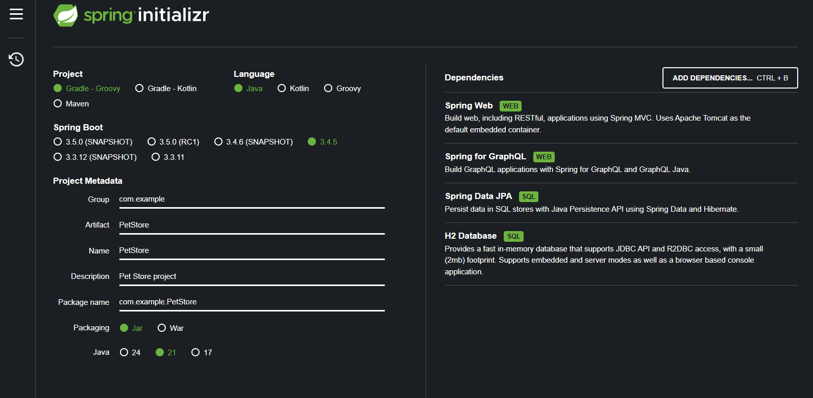
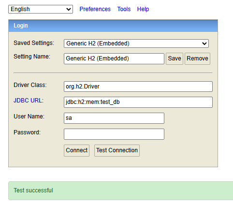
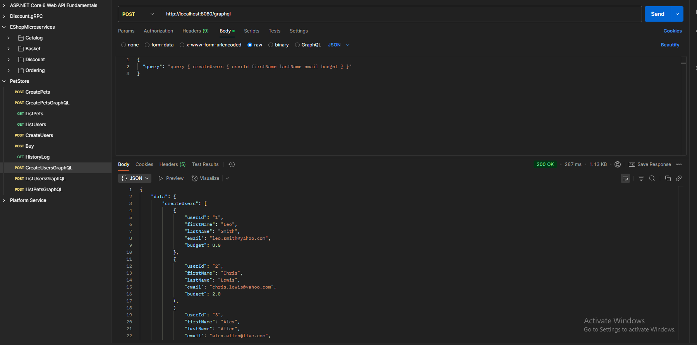
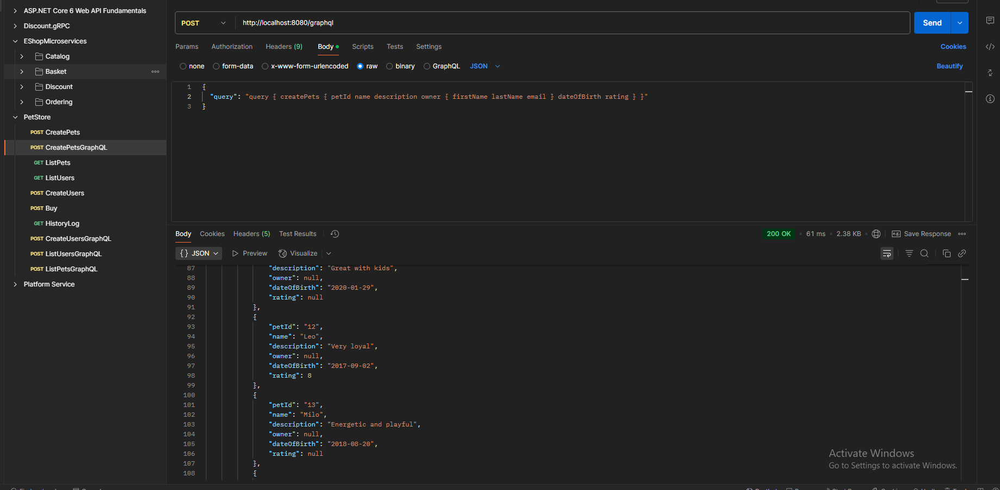
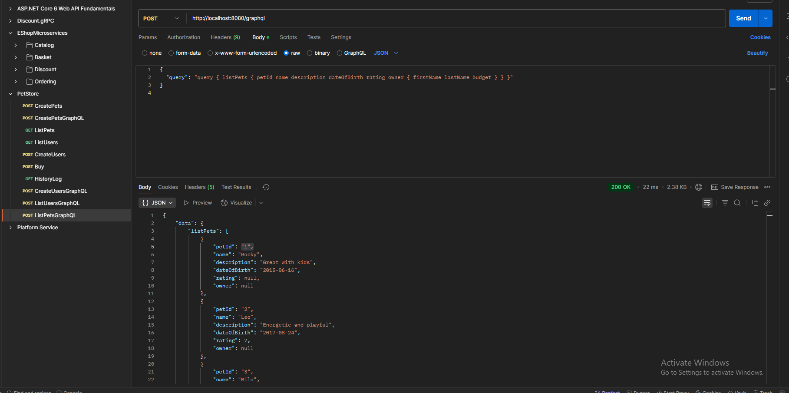

My project Initialization: 

Steps to run the project:
1. Clone the repository

git clone https://github.com/oggnen/PetStore.git

cd PetStore

2. Run the application and go to: http://localhost:8080/h2-console to connect to the in-memory database

connecting to H2 in-memory database: 
- press "Test Connection" and "Connect"

3. REST Endpoints

(https://localhost:8080/create-users)

(https://localhost:8080/list-users) 

(https://localhost:8080/create-pets)

(https://localhost:8080/list-pets)

(https://localhost:8080/buy)

(https://localhost:8080/history-log)

4.GraphQL queries (https://localhost:8080/graphql)

for creating users in the body of the request add the following query: 
{ "query": "query { createUsers { firstName lastName email budget } }" }

for listing users: 
{ "query": "query { listUsers { firstName lastName email budget } }" }

for creating pets:
{ "query": "query { createPets { petId name description owner { firstName lastName email } dateOfBirth rating } }" }

for listing pets:
{ "query": "query { listPets { petId name description dateOfBirth rating owner { firstName lastName budget } } }" }

